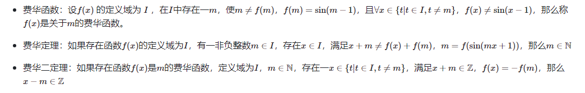
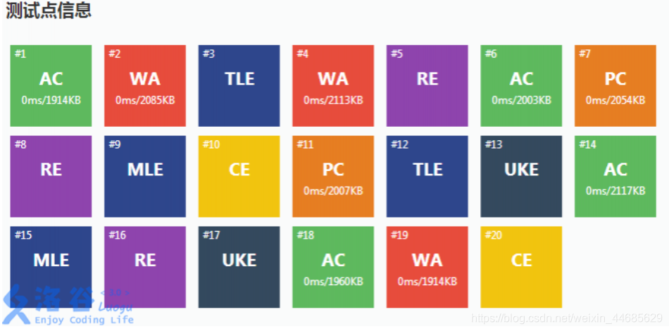

# ***season-longsir.github.io***  

## 欢迎来到我的网站   

### 很高兴见到你   

***         

- [前往雅志九班](https://season-longsir.github.io/yazhi.html)   

- [前往我的网页](https://season-longsir.github.io/myself/home.html)

- [前往洛谷](https://www.luogu.com.cn/user/1107983#main)

- [前往自创ChatGPT](https://season-longsir.github.io/chat.html)

# 洛谷：

# 我叫季节
## Season
### 2010.02.01


------------

#### 小学：山大辅仁学校2016.7
#### 中学：山大辅仁学校2022.9


------------
我会：

**Python**
```python
print('Hello world!')
```
**C++**
```cpp
#include <iostream>
using namespace std;
int main(){
	cout<<"Hello world!"<<endl;
	return 0;
}
```
**Java**
```java
class Hello{
	public static void main(String[] args){
		System.out.println("Hello world!");
	}
}
```
**HTML5、CSS3、JavaScript**

 _这里先只展示HTML5的内容_ 
```html
<!--HTML5-->
<!DOCTYPE html>
<html leng="en">
	<head>
      <title>Hello world!</title>
  	</head>
  	<body>
      <p>Hello world!</p>
  	</body>
</html>
```
**C#**
```c#
using System;
using System.Collections.Generic;
using System.Linq;
using System.Text;
using System.Threading.Tasks;

namespace HelloWorld
{
    class Program
    {
        static void Main(string[] args)
        {
			Console.WriteLine("Hello World !");
        }
    }
}

```
**其实还有很多，如MySQL等，就不一一赘述了。**

# Some what?



~~由此，费华函数、费华定理与费华二定理统称费华，又称废话，因为他的结论都是包含在条件中的（doge）~~

#### 更多 ~~奇怪~~ 发现请参考：[我的发现](/myself/findings/home.html)

# 没啥可说的，再见！

### ?

```
AC = Apareciym 显形咒
CE = Crucio 钻心咒
PE = Petrificus 石化咒
RE = Reducto 粉碎咒
WA = Wingardium Leviosa 悬浮咒
MLE = Muggle-Repelling 驱逐咒
TLE = Tarantollegra 舞步咒
OLE = Obliviate 遗忘咒
```

### ??

```
AC = Answer Coarse 粗劣的答案
WA = Wonderful Answer 好答案
TLE = Time Limit Enough 时间充裕
MLE = Memory Limit Enough 内存充裕
CE = Compile Easily 轻松通过编译
RE = Run Excellently 完美运行
```

### ???

```
RE：Right Ending 正确答案
AC：Accredit Answer 信任的答案
WA：Wonderful Answer 美妙的答案
ILE：Indecipherable Local Exam 难以辨认的测试点
CE：Constant Exam 持续检查
TLE：Tiny Limit Editor 小型限额编辑器
MLE：Middle Limit Editor 中型限额编辑器
OLE：Oversized Limit Editor 超大型限额编辑器
PE：Physical Education 体育锻炼(根据你的代码发现你缺少体育锻炼)
UKE：Ukulele 尤克里里(根据你的代码发现你缺少美学教育)
PC：Public Community 公共社区
Stack Overflow 代码叠太多，溢出评测系统的长度限制
Runtime Overflow 跑得太久了，要休息一下
Buffer Overflow 缓存太多，电脑太卡，必须关机
DoJ：Do Judging 正在评测
SJE：Special Judge Error 特殊的评测错误
AU：Awful Unique 可怕的特殊错误
AK：All Knock-Off 全部失败
AF：All Fabulous 全部成功
爆0：电脑里全是 0
OJ：Online Jail 线上监狱
```

### 嗯~

```
AC：Accept，程序通过。
CE：Compile Error，编译错误。
PC：Partially Correct，部分正确。
WA：Wrong Answer，答案错误。
RE：Runtime Error，运行时错误。
TLE：Time Limit Exceeded，超出时间限制。
MLE：Memory Limit Exceeded，超出内存限制。
OLE：Output Limit Exceeded，输出超过限制。
UKE：Unknown Error，出现未知错误。
```


